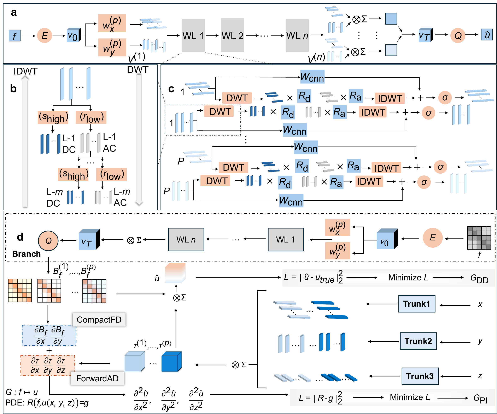

# DWNO-S-DeepONet

A neural operator for 3D-IC thermal simulation, mapping two-dimensional power maps to three-dimensional temperature fields. The method combines a Decomposed Wavelet Neural Operator (DWNO) branch with a spatially preserving Deep Operator Network (S-DeepONet), and supports data-driven, physics-driven and residual-hybrid training.



*Figure 2. DWNO and DWNO-S-DeepONet architectures.*

## Method

- **DWNO.** The two-dimensional wavelet convolution is factorized into independent one-dimensional wavelet paths along X and Y, reducing the operator complexity from O(N²) to O(PN) with P ≪ N.
- **S-DeepONet.** The branch retains per-pixel spatial coefficients instead of global pooling, so the sharp edges of the power map persist throughout the forward pass; the trunk is a separable coordinate network.
- **Training paradigms.** The same architecture supports data-driven training, physics-driven training from the PDE residual (no labels), and residual-hybrid training that corrects the systematic bias with few labels.

## Benchmarks

The method is validated on three benchmarks of increasing complexity: a two-dimensional sharp-edge Poisson benchmark, a three-dimensional single-chip benchmark, and an industrial four-high HBM (High Bandwidth Memory) multi-layer stack. Under physics-driven training without any labels, the spatial branch keeps an edge-to-flat error ratio of 1.98, and the residual hybrid reaches a mean absolute error of 0.325 K. On the multi-layer benchmark, DWNO-S-DeepONet achieves a mean absolute error of 0.121 K and a peak error of 0.33%, with a five-layer inference time of 3.99 ms, about 19,900× faster than ANSYS finite-element simulation.

## Repository structure

```
├── 2d/          2D sharp-edge Poisson benchmark
│   ├── DWNO/                  DWNO
│   ├── DWNO_S_DeepONet/       DWNO-S-DeepONet
│   ├── WNO/                   WNO
│   ├── FNO/                   FNO
│   └── D_FNO/                 D-FNO
├── 3d/          3D single-chip benchmark
│   ├── DWNO_S_DeepONet/       DWNO-S-DeepONet (data-driven)
│   ├── DWNO_DeepONet/         DWNO-DeepONet (global-pooled, data-driven)
│   ├── DWNO_S_DeepONet_Physics/  DWNO-S-DeepONet (physics-driven)
│   ├── DWNO_DeepONet_Physics/ DWNO-DeepONet (global-pooled, physics-driven)
│   ├── DFNO_S_DeepONet/       DFNO-S-DeepONet
│   ├── DFNO_DeepONet/         DFNO-DeepONet
│   ├── MLP_S_DeepONet/        MLP-S-DeepONet
│   ├── MLP_DeepONet/          MLP-DeepONet
│   ├── WNO_DeepONet/          WNO-DeepONet
│   ├── D_WNO_3D/              direct-3D DWNO (no separable trunk)
│   └── residual/              residual-hybrid training
└── multilayer/   4Hi HBM multi-layer stack
                  per-layer training (one model per heat-source layer),
                  inference via linear superposition
                  (benchmark_superposition.py)
```

## Environment

```bash
conda env create -f environment.yml
conda activate dwno-s-deeponet
```

## Data

Download the training and test datasets from the SJTU cloud share:

**[Download training and test datasets](https://pan.sjtu.edu.cn/web/share/55da1203e7969f98f52b81c58bbdfa2a)**

The datasets are distributed separately from the source code and are not bundled
with this repository. After downloading, extract any data archives and place the
NumPy files in the top-level `data/` directory, alongside `2d/`, `3d/`, and
`multilayer/`. If the download already contains a folder named `data`, copy that
folder into the repository root; do not create an extra `data/data/` level.

Keep the benchmark subdirectories and filenames unchanged. The scripts expect
the following directory layout and filenames:

```
data/
├── 2d/            f_train.npy    f_test.npy
│                  u_train.npy    u_test.npy
├── 3d/            f_train.npy    f_test.npy
│                  u_train.npy    u_test.npy
│                  f_train_physics.npy
└── multilayer/    f_train.npy    f_test.npy
                   u_train_z{1,4,8,12,16}.npy
                   u_test_z{1,4,8,12,16}.npy
                   f_test_multi.npy
                   u_test_multi.npy
```

The `f_train` and `u_train` files contain training inputs and corresponding
targets; `f_test` and `u_test` contain the held-out test inputs and targets.
Keep the input/target sample ordering aligned. The physics-driven experiment
additionally reads `data/3d/f_train_physics.npy`. The multi-layer training scripts
read the layer-specific `u_train_z*.npy` and `u_test_z*.npy` files, while the
superposition benchmark reads `f_test_multi.npy` and `u_test_multi.npy`.

If the share is unavailable or requests access you do not have, contact the
repository maintainer for an updated data download link.

## Running the experiments

Run the commands below from the repository root, after setting up the environment
and placing the datasets as described above. Trained model checkpoints are not
included in this code package; generate them before running any experiment that
depends on saved weights.

2D benchmark (DWNO):

```bash
python 2d/DWNO/train_dwno_2d_jax.py
```

3D single-chip, data-driven (DWNO-S-DeepONet):

```bash
python 3d/DWNO_S_DeepONet/train_dwno_deeponet_jax_3d.py
```

3D physics-driven (no labels):

```bash
python 3d/DWNO_S_DeepONet_Physics/train_heat3d_physics.py
```

Residual hybrid (run the physics-driven training above first):

Before starting, confirm that
`3d/DWNO_S_DeepONet_Physics/results/baseline/dwno_deeponet_physics_3d_bpss.eqx`
exists. Without this checkpoint, the residual script falls back to a randomly
initialized physics model rather than the pretrained model needed for the hybrid
experiment.

```bash
python 3d/residual/train_residual.py
```

4Hi HBM multi-layer: train one model for each of the five heat-source layers:

```bash
python multilayer/DWNO_S_DeepONet/train.py --z 1
python multilayer/DWNO_S_DeepONet/train.py --z 4
python multilayer/DWNO_S_DeepONet/train.py --z 8
python multilayer/DWNO_S_DeepONet/train.py --z 12
python multilayer/DWNO_S_DeepONet/train.py --z 16
```

`benchmark_superposition.py` compares six architectures, not only
DWNO-S-DeepONet. Before running the full comparison, repeat the five-layer
training for each of the other architecture directories:
`DWNO_DeepONet`, `DFNO_S_DeepONet`, `DFNO_DeepONet`, `MLP_S_DeepONet`, and
`MLP_DeepONet`. The benchmark expects all 30 layer-specific checkpoints in the
corresponding `multilayer/<architecture>/results/z<layer>/` directories.

After all required checkpoints have been generated:

```bash
python multilayer/benchmark_superposition.py
```

## Citation

If you use this code in your research, please cite the manuscript (details to be added upon publication).

## License

This code is provided under the [Research Reproduction License](LICENSE.md).
Editorial assessment, peer review, and reproduction and verification of the
associated paper are permitted. Commercial and unrelated uses require separate
written permission. This is a restricted source-available license, not the MIT
License or an OSI-approved open-source license.
